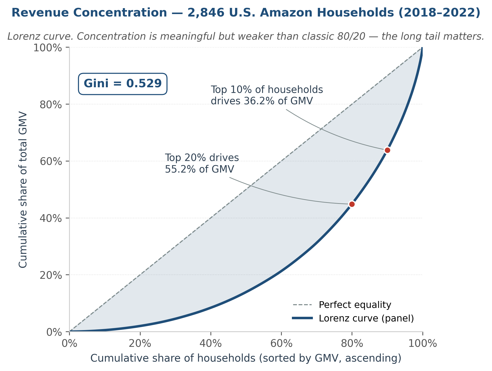
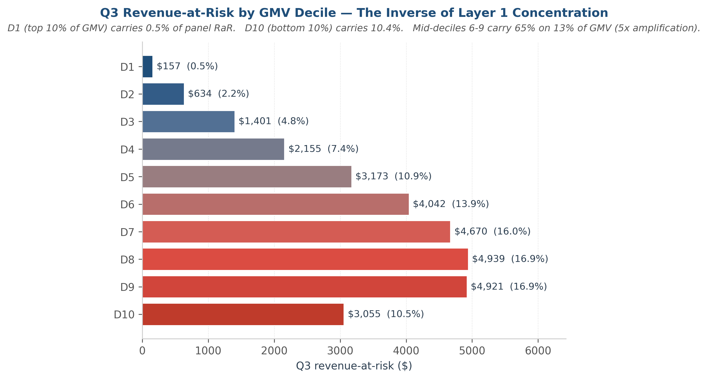
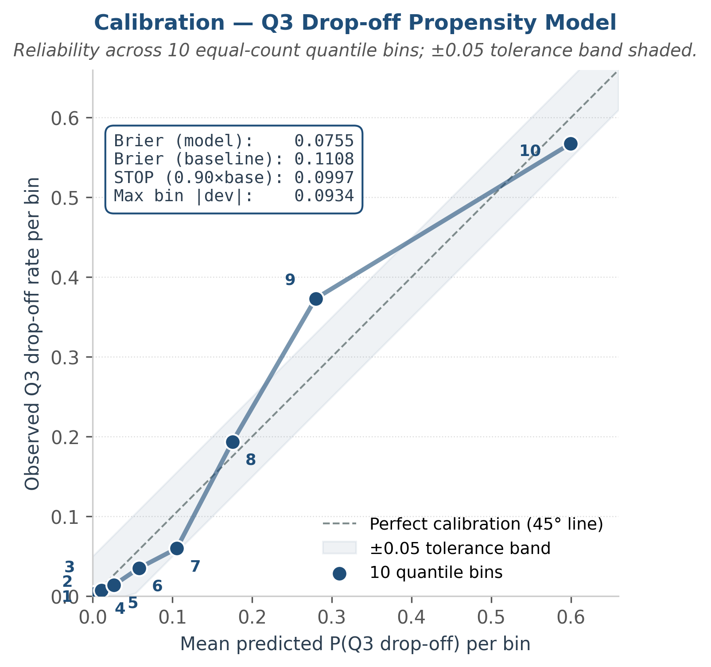
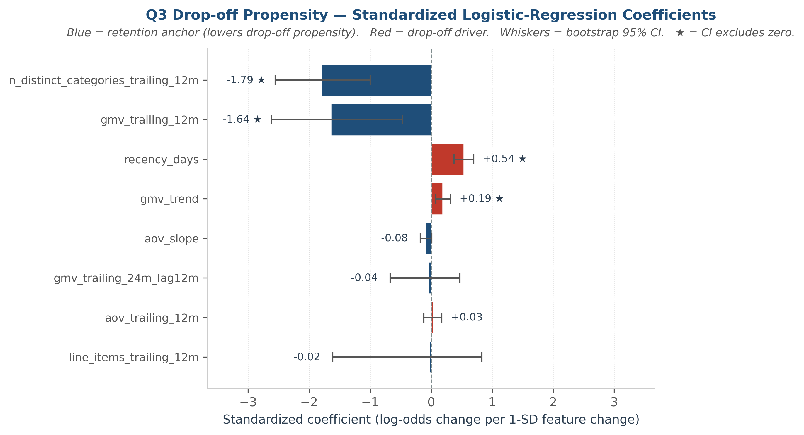
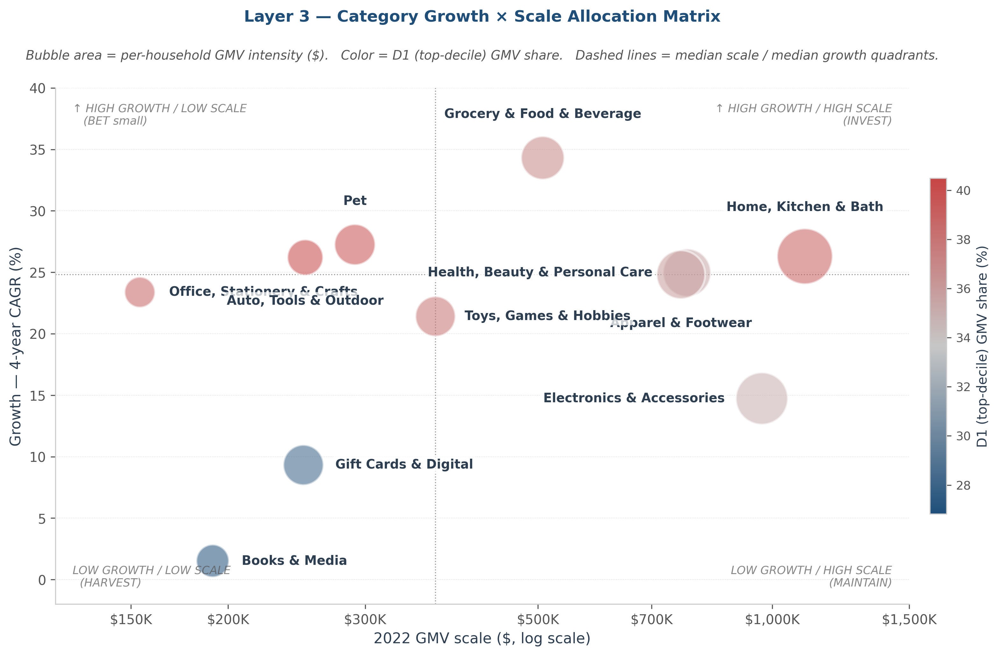
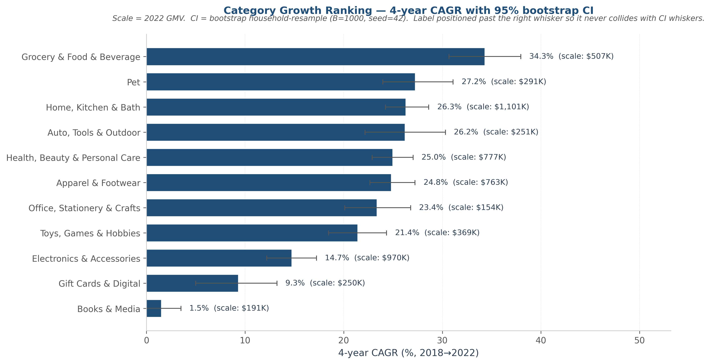
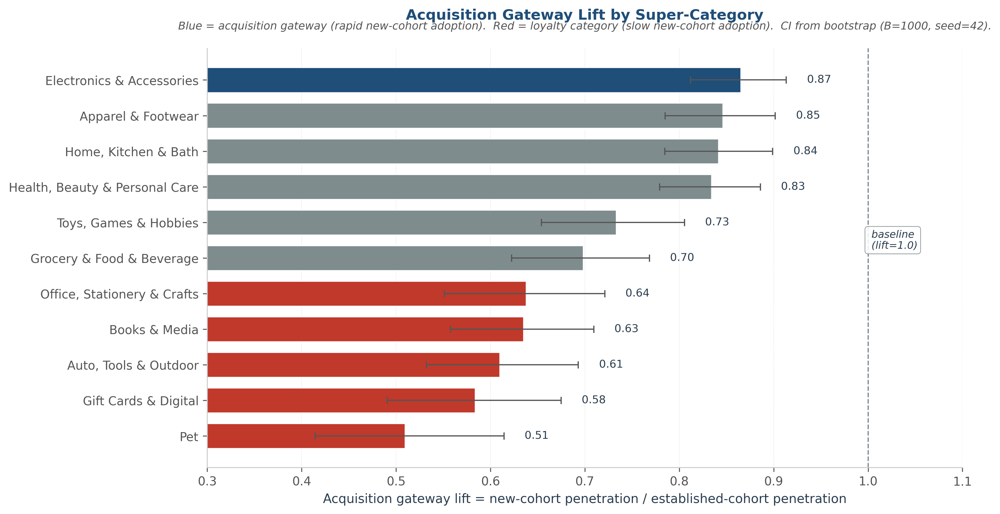
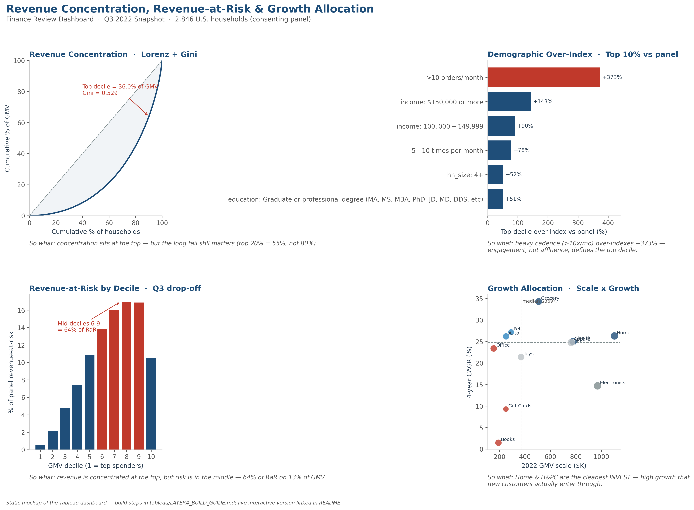

# Amazon Revenue Analytics
*Concentration, Forward-Looking Revenue-at-Risk, and Growth Allocation*

**A BI framework for finance decision support, built on 2,846 U.S. Amazon households (2018–2022).**

[](outputs/figures/layer1/lorenz_curve.png)

---

## TL;DR

Three finance questions on a 2,846-household U.S. Amazon panel (2018–2022, ~1.05M transactions): where revenue concentrates, what is at risk next quarter, and which categories deserve incremental budget.

The short version — concentration sits at the top (the top 10% of households drive 36% of GMV), forward-looking risk sits in the middle (mid-tier deciles carry 65% of next-quarter revenue-at-risk while the top decile carries 0.5%), and growth runs in two lanes (some categories grow by acquiring new households, others by deepening existing ones).

Method is SQL-first (DuckDB) with a Polars cross-check on every aggregation, bootstrap 95% CIs on every headline ratio, and a cross-layer crosswalk that folds the concentration and risk findings into the category view. Detailed findings, methodology, and limitations below.

---

## Contents

- [TL;DR](#tldr)
- [The Question](#the-question)
- [The Answer](#the-answer)
- [The Method](#the-method)
- [The Caveat](#the-caveat)
- [Methodology](#methodology)
- [Layer 3 — Category Allocation Matrix](#layer-3--category-allocation-matrix-deep-dive)
- [Layer 4 — Finance Review Dashboard](#layer-4--finance-review-dashboard)
- [Limitations](#limitations)
- [Repository Structure](#repository-structure)
- [Tech Stack](#tech-stack)
- [How to Run](#how-to-run)
- [Analytical Layers](#analytical-layers)
- [Author](#author)

---

## The Question

The Amazon Retail Finance team needs to understand three things to inform next-quarter resource allocation:

1. Where is revenue concentrated, and is concentration growing?
2. Which customer segments represent the largest forward-looking revenue-at-risk in the next quarter?
3. Which categories deserve priority investment given current growth × scale dynamics?

This project answers each question with a dedicated analytical layer.

## The Answer

**Layer 1 — concentration.** Within this 2,846-household consenting panel, **the top decile drives 36.0% of GMV** (top 20%: 54.9%; Gini = 0.529). That is meaningful concentration, but well short of a classic 80/20 split — the long tail still matters, so the data suggests a dual lens rather than a VIP-only focus.

Decomposing the gap shows it is **~94% purchase frequency, only ~6% basket size**: top-decile households make 10.9× more purchases (1,224 vs 112 line-item purchases) but spend just 1.18× more per purchase. The data suggests engagement-cadence levers address this driver far more directly than premium-tier upsell — a premium strategy would close only ~6% of the per-household gap.

The strongest demographic signal is cadence, not affluence: households shopping more than 10 times per month over-index **+373% [CI: +308%, +443%]**, dwarfing $150K+ income (+143%). And concentration actually *fell* during COVID (Δ Gini = -0.039) while panel GMV nearly doubled — the surge was mass-market expansion, not VIP-only concentration.

**Layer 2 — revenue concentration is at the top, but revenue-at-risk is in the middle.** Layer 1 showed the top decile's edge is ~94% purchase-frequency *cadence*. If cadence is the moat, it is also a stability proxy — so forward-looking risk should surface where cadence is least stable, which is not the top. The data bears this out: top decile drives 36.0% of GMV but only **0.5% of forward-looking RaR** ($157 of $29,148 panel total). Bottom decile contributes 0.5% of GMV but carries **10.5% of RaR** ($3,055) — a **~19x asymmetry** between best-and-worst-case forward stability. Mid-deciles (6-9) carry **64% of RaR while accounting for only 13% of GMV** (~5x amplification). The data shows mid-tier RaR exposure is materially larger than top-tier exposure on a panel-share basis.

[](outputs/figures/layer2/decile_rar_ladder.png)

*Layer 2 credibility evidence — model calibration across 10 probability bins, and standardized coefficients with bootstrap 95% CIs:*

[](outputs/figures/layer2/calibration_curve.png)
[](outputs/figures/layer2/coefficient_chart.png)

**Layer 3 — naive Scale × Growth lies; the Layer 1+2 cross-layer lens reframes allocation.** Layer 1 located where revenue *is* and Layer 2 located where risk *is*; Layer 3 asks where incremental budget should *go*. Scale × Growth alone would mislead, so the decile structure (Layer 1) and per-household RaR (Layer 2) are folded back into the category view. Twelve super-categories were rolled up from 1,816 raw Amazon browse-node labels (Claude Opus 4.7 taxonomy, 89% specific-mapped, audit JSON committed). A naive Scale × Growth quadrant would label Pet/Health "INVEST" and Books "MAINTAIN" — both readings shift once the cross-layer crosswalk is applied: **the data suggests Pet behaves as VIP-anchored loyalty** (D1 share = 40% of Pet GMV, lowest mid-decile share at 9.6%, lowest acquisition-gateway lift at 0.51), not RaR mitigation. **Books behaves more like a broad-base retention category** (D1 share = 27%, lowest of any super-category; 88% panel breadth; mid-decile GMV share = 19%) — so harvesting it would worsen Layer 2's mid-decile RaR concentration. **The acquisition surface is broad-utility commodity categories** (Electronics 0.87 / Apparel 0.85 / Home 0.84 / H&PC 0.83), not specialty verticals. The data suggests segmenting allocation into three lanes (top-decile retention, mid-decile RaR mitigation, customer acquisition) rather than one growth bet per category.

[](outputs/figures/layer3/category_allocation_matrix.png)

## The Method

SQL-first analysis (DuckDB) on ~1.05M Amazon transactions, cohort-capped at 2023-01-01 due to post-2023 participant attrition. **Layer 1:** NTILE(10) decile assignment; Lorenz + Gini for concentration shape; log-decomposition for the frequency-vs-basket driver split; bootstrap 95% CIs (B=1000, seed=42) on demographic over-index ratios. **Layer 2:** walk-forward validated logistic regression (features as-of 2022-06-30, validated against 2022-Q3 actuals); SQL-level leakage guard + shuffle-label diagnostic (median AUC 0.54 on shuffled labels, max 0.57 — below the 0.60 leakage-suspicion threshold); bootstrap CIs on AUC, coefficients, and segment-level RaR; calibration verified via reliability diagram across 10 quantile bins. **Layer 3:** Claude Opus 4.7 generates a deterministic 1,816→12 super-category taxonomy (audit JSON committed, 89% specific-mapped + 50-row spot-check); 4-year CAGR (`(2022/2018)^(1/4) − 1`) over raw growth-rate to avoid COVID-baseline distortion; bootstrap CIs on every metric; cross-layer crosswalk joins Layer 1 decile structure + Layer 2 RaR per household into the allocation matrix. Every core aggregation is cross-validated against a Polars equivalent for byte equality.

## The Caveat

The 2,846 households are a **consenting subsample** of 5,027 Prolific prescreen respondents — not a random sample of Amazon's broader customer base. The panel's 87% Q3 activity rate is a **selection-bias upper bound** on engagement. Revenue-at-risk (RaR) here means the expected GMV exposure when a household's modeled probability of Q3 inactivity is applied to its expected Q3 spend — a single-quarter decision-support exposure, not a claim of permanent revenue loss. Layer 2 RaR magnitudes should therefore be read as upper bounds: the analytical framework (propensity model + segment-level aggregation + bootstrap CIs) generalizes, but absolute dollars require re-validation on production cohorts before downstream use. Demographics are a 2021 snapshot, not a time series.

---

## Methodology

Every headline number is backed by an explicit audit trail — SQL ↔ Polars byte-equality cross-validation, bootstrap CIs (B=1000, seed=42), the feature-leakage defense, the calibration trade-off, the LLM-taxonomy audit, and each mid-project revision. The full per-layer write-up lives in **[METHODOLOGY.md](METHODOLOGY.md)**.

## Layer 3 — Category Allocation Matrix (Deep Dive)

### The question

> *Which categories deserve priority investment given current growth × scale dynamics?*

The 11 specific super-categories below (plus an explicit `Other / Unknown` bucket) are rolled up from 1,816 raw browse-node leaves via a committed Claude Opus 4.7 taxonomy — coverage, false-positive audit, and JSON path are in [METHODOLOGY.md](METHODOLOGY.md) (Layer 3).

### Scale × Growth dimensions

- **Scale** = 2022 GMV per super-category (current footprint within this panel).
- **Growth** = 4-year CAGR, `(2022 GMV / 2018 GMV)^(1/4) − 1` (the 4-year window normalizes through COVID distortion; rationale in [METHODOLOGY.md](METHODOLOGY.md)).
- **Panel median scale**: **$369K** (Toys); **panel median CAGR**: **24.8%** (Apparel) — these define the quadrant split below.

### Category growth ranking

[](outputs/figures/layer3/category_ranking_table.png)

Grocery leads at **34.3%** CAGR and Books & Media floors at **1.5%**; the figure above carries the full 11-category ranking with bootstrap CIs, and every category's scale and CAGR appears in the quadrant table below.

### BCG-style quadrant readout

[](outputs/figures/layer3/category_allocation_matrix.png)

Splitting the 11 super-categories along the median scale ($369K) and median CAGR (24.8%) lines:

| Quadrant | n | Super-categories (scale, CAGR) |
|---|---|---|
| **INVEST** — high growth × high scale | 3 | Grocery ($507K, 34.3%) · Home, Kitchen & Bath ($1,101K, 26.3%) · Health, Beauty & Personal Care ($777K, 25.0%) |
| **BET-small** — high growth × low scale | 2 | Pet ($291K, 27.2%) · Auto, Tools & Outdoor ($251K, 26.2%) |
| **MAINTAIN** — low growth × high scale | 1 | Electronics & Accessories ($970K, 14.7%) |
| **HARVEST** — low growth × low scale | 3 | Office, Stationery & Crafts ($154K, 23.4%) · Gift Cards & Digital ($250K, 9.3%) · Books & Media ($191K, 1.5%) |
| At median boundary | 2 | Apparel & Footwear ($763K, 24.8% — at median CAGR) · Toys, Games & Hobbies ($369K, 21.4% — at median scale) |

### The differentiator — high growth ≠ acquisition gateway

A naïve BCG read says "invest in INVEST, harvest HARVEST." Layer 3 adds a second lens — **cohort acquisition-gateway lift** (new-cohort vs established-cohort category penetration; n=196 vs 2,649). All values are < 1.0, so the **relative ranking is the signal**, not the absolute level.

[](outputs/figures/layer3/category_gateway_lift.png)

| Tier | Lift range | Categories |
|---|---|---|
| Fast-adoption (top 4 by rank) | 0.83–0.87 | Electronics (0.87) · Apparel (0.85) · Home, Kitchen & Bath (0.84) · Health, Beauty & Personal Care (0.83) |
| Neutral mid-tier (rank 5–8) | 0.63–0.73 | Toys (0.73) · Grocery (0.70) · Office (0.64) · Books (0.63) |
| Loyalty / repeat-purchase (bottom 3) | 0.51–0.61 | Auto (0.61) · Gift Cards (0.58) · Pet (0.51) |

**Cross-tabbing the BCG quadrant and the adoption-speed tier produces the operational allocation insight:**

- **Double signal — INVEST × fast-adoption.** Home, Kitchen & Bath and Health, Beauty & Personal Care: high growth that is structurally durable because new customers enter via these categories, not just existing ones spending more. The cleanest INVEST candidates.
- **Loyalty-depth growth — INVEST/BET × low gateway.** Grocery, Pet, and Auto: strong secular growth but weak new-cohort penetration — the data suggests existing-customer deepening, not new-household acquisition. Retention framing, not acquisition.
- **Stalled acquisition surface — MAINTAIN × fast-adoption.** Electronics has the highest lift of any super-category but below-median growth: a traditional first-purchase category whose growth has plateaued — defensive maintenance, not a growth bet.
- **Pure defensive — HARVEST × neutral/low gateway.** Books, Gift Cards, and Office. Books is the cleanest structural-decline read — low growth, low scale, neither acquisition surface nor loyalty anchor.

### Layer 1+2 cross-layer crosswalk

Folding Layer 1 deciles + Layer 2 RaR back in per super-category (D1 GMV share, mid-decile RaR, household breadth) is what makes the matrix actionable:

- **Pet** has high D1 GMV concentration (39.9% from top decile — second only to Auto, Tools & Outdoor at 40.5%) and the lowest mid-decile GMV share (9.6%). With its 0.51 gateway lift, the data suggests Pet behaves as a VIP-anchored loyalty category — not a RaR-mitigation target, despite landing in BET-small on Scale × Growth alone. One caveat on this reading: a high D1 GMV share can reflect either category loyalty (heavy users repeat-buy) or niche-ness (a small buyer pool mechanically concentrates share). Cleanly separating the two would require intra-decile repeat-purchase frequency, which is not computed here — so the loyalty interpretation is directional, and the niche alternative is not fully ruled out.
- **Books** has the lowest D1 GMV concentration (26.8%) and broadest panel reach (87.7% of households). It's the closest super-category to a broad-base retention anchor — so the naïve "HARVEST Books" read would hit mid-decile households Layer 2 flagged as carrying 65% of panel RaR.

Full crosswalk parquet + Layer 3-specific limitations (sub-category granularity, gateway lift < 1.0 by construction, no cost-side data) are in [METHODOLOGY.md](METHODOLOGY.md) and the Limitations below.

---

## Layer 4 — Finance Review Dashboard

A single-screen Tableau dashboard folds the three layers back into the finance-stakeholder view from [The Question](#the-question) — built so the three findings land in a 30-second skim, one "so what" per panel.

[](https://public.tableau.com/app/profile/leo.wan3084/viz/AmazonFinanceReviewDashboardQ32022/Dashboard1)

🔗 **[Open the live interactive dashboard on Tableau Public →](https://public.tableau.com/app/profile/leo.wan3084/viz/AmazonFinanceReviewDashboardQ32022/Dashboard1)** *(static preview above; click to filter/hover the published version)*

| Panel | Finding (the "so what") |
|---|---|
| **Revenue Concentration** — Lorenz + Gini | Concentration sits at the top — but the long tail still matters (top 20% = 55%, not 80%). |
| **Demographic Over-Index** — top 10% vs panel | Heavy cadence (>10×/mo) over-indexes +373% — engagement, not affluence, defines the top decile. |
| **Revenue-at-Risk by Decile** — Q3 drop-off | Revenue is at the top, but risk is in the middle — mid-deciles 6–9 carry 65% of RaR on 13% of GMV. |
| **Growth Allocation** — Scale × Growth | Home & H&PC are the cleanest INVEST — high growth that new customers actually enter through. |

The image is a static mockup; the interactive version (filters, tooltips) lives on Tableau Public. Panel-by-panel build steps and the field spec are in [`tableau/LAYER4_BUILD_GUIDE.md`](tableau/LAYER4_BUILD_GUIDE.md); the dashboard reads from the committed CSV extracts in [`tableau/`](tableau/), regenerated by `src/build_tableau_extracts.py`.

---

## Limitations

- **Consenting subsample, not Amazon's customer base.** All concentration and RaR numbers should be read as "within this 2,846-household panel," never "across Amazon's customers." Selection bias is plausible — people who consent to share purchase data may differ from those who don't. The panel's 87% Q3 activity rate is direct evidence of this selection-bias direction: the panel is more engaged than the broader Amazon population.
- **Single-quarter outcome window.** Layer 2's `is_dropoff_q3` measures absence of any purchase in 2022-Q3. This is *not* permanent churn — a diagnostic check found that ~30% of households silent for the trailing 12 months reactivate within the next quarter. The terminology used throughout Layer 2 is "Q3 drop-off" or "Q3 inactivity," never "churn," to preserve this distinction.
- **Cohort cap at 2023-01-01.** Post-2023 data is sparse (22,569 of 1,048,575 rows, ~2.2%) due to participant attrition. Including post-2023 data would right-censor users who simply stopped reporting purchases. **One household excluded:** `R_1d1fnT4sjZABBwe`, single $1.84 order on 2024-08-15 — clearly a late panel joiner with no 2018–2022 activity.
- **Demographics are a 2021 snapshot.** Income, state, household size are recorded once at survey time. They are not a time series; a household whose income changed between 2018 and 2024 will be misclassified along that dimension.

---

## Repository structure

```
amazon-revenue-analytics/
├── README.md                              ← you are here
├── METHODOLOGY.md                          ← full per-layer methodology + audit trail
├── MANIFEST.md                            ← input hashes, output schemas, runtime
├── LICENSE                                ← MIT
├── requirements.txt
├── data/raw/                              ← source CSVs (gitignored)
│   ├── amazon-purchases.csv               ← 1,048,575 transactions, 173 MB
│   ├── survey.csv                         ← 5,027 respondents × 23 demographics
│   └── fields.csv                         ← survey column dictionary
├── sql/                                   ← canonical SQL aggregations (first-class)
│   ├── 01_user_gmv_capped.sql             ← Layer 1: user-level GMV, STRPTIME cohort cap
│   ├── 02_decile_assignment.sql           ← Layer 1: NTILE(10) window function
│   ├── 03_decile_contribution.sql         ← Layer 1: decile × GMV percent rollup
│   ├── 04_demographic_join.sql            ← Layer 1: decile-tagged table ⨝ survey demographics
│   ├── 05_household_features.sql          ← Layer 2: 8 features + walk-forward leakage guard
│   ├── 06_q3_outcome.sql                  ← Layer 2: `is_dropoff_q3` outcome variable
│   └── 07_category_rollup.sql             ← Layer 3: super-category × year rollup (joins taxonomy JSON)
├── src/                                   ← reusable Python helpers
│   ├── data_loader.py                     ← Polars / DuckDB loaders + date probe
│   ├── stats_utils.py                     ← Gini, Lorenz points, bootstrap over-index CI
│   ├── viz_utils.py                       ← finance-clean matplotlib styling
│   ├── manifest_utils.py                  ← SHA256 + MANIFEST writer
│   ├── build_tableau_extracts.py          ← Layer 4: parquet → Tableau CSV extracts
│   └── build_layer4_mockup.py             ← Layer 4: static 2×2 dashboard mockup
├── notebooks/
│   ├── 01_layer1_concentration.ipynb      ← Layer 1 main analysis
│   ├── 02_layer2_rar.ipynb                ← Layer 2 main analysis (forward-looking RaR)
│   └── 03_layer3_allocation.ipynb         ← Layer 3 main analysis (growth allocation matrix)
├── tableau/                               ← Layer 4: dashboard data + build guide
│   ├── LAYER4_BUILD_GUIDE.md              ← click-by-click Tableau Public build
│   └── *.csv                              ← 6 panel extracts (Lorenz, decile, over-index, RaR×2, scale×growth)
└── outputs/
    ├── tables/                            ← 10 parquet tables (gitignored — regenerable)
    └── figures/                           ← 11 PNG figures @ 300 dpi (committed), organized by layer
        ├── layer1/                         ← lorenz_curve, decile_contribution_bar, concentration_over_time
        ├── layer2/                         ← decile_rar_ladder (hero), coefficient_chart, calibration_curve, roc_curve
        ├── layer3/                         ← category_allocation_matrix (hero), category_ranking_table, category_gateway_lift
        └── layer4/                         ← dashboard_mockup (2×2 Finance Review Dashboard)
```

## Tech stack

- **SQL:** DuckDB (in-process, reads CSV / Parquet directly — no separate database)
- **Python:** Polars (1M-row aggregation), Pandas (survey-side joins), NumPy (bootstrap)
- **Stats / ML:** NumPy (Lorenz, Gini, bootstrap CIs); scikit-learn (logistic regression, ROC, calibration)
- **Viz:** matplotlib + seaborn (finance-clean styling, locked palette in `src/viz_utils.py`)
- **Notebooks:** Jupyter (deliverable format)

Why parquet and not CSV for outputs: columnar, 5–10× smaller, no float-precision loss, standard in BI workflows.

## How to Run

```bash
git clone <repo>
cd amazon-revenue-analytics
python -m venv .venv && source .venv/bin/activate
pip install -r requirements.txt
# Place amazon-purchases.csv, survey.csv, fields.csv in data/raw/
# Verify hashes against MANIFEST.md if reproducing exact numbers.
jupyter notebook notebooks/01_layer1_concentration.ipynb   # then 02_layer2_rar.ipynb
```

Observed runtime: **~5 sec** for Layer 1, **~7 sec** for Layer 2 (both on M-series Mac). Layer 2's full bootstrap pipeline — 1,000 LR re-fits for AUC + coefficient CIs, 50 shuffle-label refits, 51,000 segment-RaR resamples — completes in ~3 sec combined via vectorised NumPy.

## Analytical Layers

| Layer | Question | Status | Notebook |
|---|---|---|---|
| 1 | Where is revenue concentrated? | ✅ Done | `notebooks/01_layer1_concentration.ipynb` |
| 2 | What revenue is at risk next quarter? | ✅ Done | `notebooks/02_layer2_rar.ipynb` |
| 3 | Which categories to invest in? | ✅ Done | `notebooks/03_layer3_allocation.ipynb` |
| 4 | Can finance see it all in one screen? | ✅ [Live on Tableau Public](https://public.tableau.com/app/profile/leo.wan3084/viz/AmazonFinanceReviewDashboardQ32022/Dashboard1) | `tableau/` + `LAYER4_BUILD_GUIDE.md` |

## Author

Built by **Leo Wan**, BUAI (Business of Artificial Intelligence) program — USC Marshall School of Business & Viterbi School of Engineering. Targeting Summer 2027 BI/DA Analyst internships.
