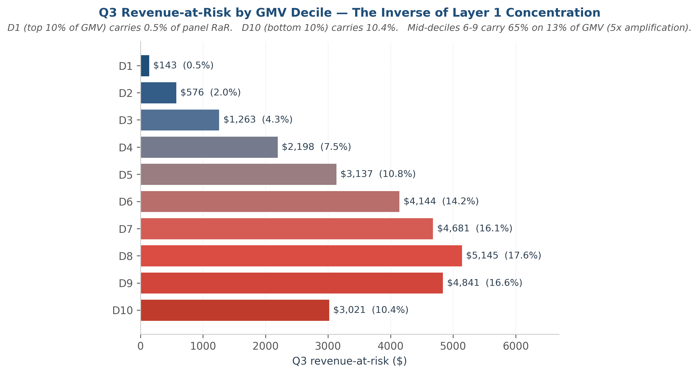

# Amazon Revenue Analytics
*Concentration, Forward-Looking Revenue-at-Risk, and Growth Allocation*

**A BI framework for finance decision support, built on 2,846 U.S. Amazon households (2018–2022).**

[](outputs/figures/lorenz_curve.png)

---

## Contents

- [The Question](#the-question)
- [The Answer](#the-answer)
- [The Method](#the-method)
- [The Caveat](#the-caveat)
- [Methodology Notes](#methodology-notes)
- [Limitations](#limitations)
- [Repository Structure](#repository-structure)
- [Tech Stack](#tech-stack)
- [How to Run](#how-to-run)
- [Analytical Layers](#analytical-layers)
- [About](#about)

---

## The Question

The Amazon Retail Finance team needs to understand three things to inform next-quarter resource allocation:

1. Where is revenue concentrated, and is concentration growing?
2. Which customer segments represent the largest forward-looking revenue-at-risk in the next quarter?
3. Which categories deserve priority investment given current growth × scale dynamics?

This project answers each question with a dedicated analytical layer.

## The Answer

**Layer 1 — concentration.** Within this 2,846-household consenting panel, **the top decile drives 36.2% of GMV** (top 20%: 55.2%; Gini = 0.529). Decomposition reveals the gap is **~94% purchase-frequency, only ~6% basket size** — top-decile households order 11.0× more often (1,222 vs 111 orders) but spend just 1.18× more per order. The strongest demographic signal is heavy cadence — households shopping more than 10 times per month over-index **+387% [CI: +324%, +457%]**, dwarfing $150K+ income (+154%). Concentration actually *fell* during COVID (Δ Gini = −0.04) while panel GMV nearly doubled — mass-market expansion, not VIP-only concentration. The data suggests engagement-cadence levers would address this driver more directly than premium-tier upsell — premium strategies would close only ~6% of the per-household gap.

**Layer 2 — revenue concentration is at the top, but revenue-at-risk is in the middle.** Top decile drives 36.2% of GMV but only **0.5% of forward-looking RaR** ($143 of $29,148 panel total). Bottom decile contributes 0.5% of GMV but carries **10.4% of RaR** ($3,021) — a **21x asymmetry** between best-and-worst-case forward stability. Mid-deciles (6-9) carry **65% of RaR while accounting for only 13% of GMV** (5x amplification). The data suggests a reallocation of retention budget from VIP defense to mid-tier engagement.

[](outputs/figures/decile_rar_ladder.png)

## The Method

SQL-first analysis (DuckDB) on ~1.05M Amazon transactions, cohort-capped at 2023-01-01 due to post-2023 participant attrition. **Layer 1:** NTILE(10) decile assignment; Lorenz + Gini for concentration shape; log-decomposition for the frequency-vs-basket driver split; bootstrap 95% CIs (B=1000, seed=42) on demographic over-index ratios. **Layer 2:** walk-forward validated logistic regression (features as-of 2022-06-30, validated against 2022-Q3 actuals); SQL-level leakage guard + shuffle-label diagnostic (median AUC 0.54 on shuffled labels, max 0.57); bootstrap CIs on AUC, coefficients, and segment-level RaR; calibration verified via reliability diagram across 10 quantile bins. Every core aggregation is cross-validated against a Polars equivalent for byte equality.

## The Caveat

The 2,846 households are a **consenting subsample** of 5,027 Prolific prescreen respondents — not a random sample of Amazon's broader customer base. The panel's 87% Q3 activity rate is a **selection-bias upper bound** on engagement; Layer 2 RaR magnitudes should be read as upper bounds, with the analytical framework (propensity model + segment-level aggregation + bootstrap CIs) generalizing but absolute dollars requiring re-validation on production cohorts before downstream use. Demographics are a 2021 snapshot, not a time series.

---

## Methodology Notes

**Layer 1 (concentration analysis):**

- **`Order Date` raw format is `M/D/YY`.** Implicit `CAST("Order Date" AS DATE)` parses only **28.6%** of these strings; the other 71% silently NULL. All SQL in `sql/` uses explicit `STRPTIME("Order Date", '%-m/%-d/%y')`. Using CAST would have understated Layer 1 GMV by ~70%.
- **Cross-validation discipline.** Every core aggregation in Layers 1–2 has a SQL implementation (under `sql/`, the artifact a recruiter screenshots) and a Polars implementation (the dataframe code in the notebook). The two are asserted byte-equal (or float-equal within FP tolerance) before any parquet is saved. Divergence would surface silent aggregation bugs — the most notable catch in this project was a `n_distinct_categories_trailing_12m` mismatch where Polars's `n_unique()` counted NULL as a distinct value while SQL's `COUNT(DISTINCT)` does not (1,684-household discrepancy on the same feature).
- **Confidence intervals on all reported ratios.** No headline number is reported as a point estimate alone. Bootstrap is non-parametric (B=1000, seed=42), so it makes no normality assumption — appropriate for the heavy-tailed GMV distribution. Findings whose 95% CIs cross zero are recorded but excluded from the headline.
- **Audit-trail manifest.** `MANIFEST.md` at project root carries SHA256 hashes of the three input CSVs, schemas + row counts of every output `.parquet`, dimensions of every output figure, and observed runtime. A reviewer can verify input integrity via `shasum -a 256 data/raw/*.csv`.

**Layer 2 (forward-looking RaR):**

- **Outlier treatment evolution (R13 bilateral revision).** Numeric features are winsorized at the 1st and 99th percentiles (bilateral) before z-score standardization. The original Layer 2 plan called for single-tail (99th-percentile only); symmetric-tail features (`aov_slope`, `gmv_trend`) in the 8-feature mix would have produced max |z| = 21.6 on the negative `aov_slope` tail under the single-tail form. A safety-threshold assertion caught this mid-Task-7.3, and the bilateral extension preserves the original intent while accommodating the actual feature distribution. The winsorize-then-z-score order is locked — applying z-score first would leave heavy-tail leverage in the fit; winsorize first removes extreme rows before standardization measures dispersion.
- **Feature leakage defense (SQL guard + empirical validation).** `sql/05_household_features.sql` wraps every feature aggregation in an outer-CTE filter on `Order Date < 2022-07-01`, blocking post-cutoff data at the SQL level. A shuffle-label diagnostic then permuted `is_dropoff_q3` 50 times and refit the full pipeline: median shuffled AUC was 0.54, max 0.57 — well below the 0.60 leakage gate and near the 0.50 random baseline. The real-label AUC of 0.9052 reflects genuine signal from pre-cutoff features, not accidentally leaked information from post-cutoff data. The SQL guard is the structural defense; the shuffle-label diagnostic is the empirical validation that the guard worked.
- **Calibration & STOP rule revision.** Logistic regression calibration was evaluated across 10 probability quantile bins (~284 households per bin). Nine bins fell within ±0.05 of perfect; bin 9 (predicted ≈ 28%, 284 households) showed actual drop-off of 37% — a 9.3pp underestimate. RaR estimates concentrated in this probability range carry a known ~25% systematic downward bias and are reported as lower bounds. Brier-score information gain over baseline is 32% (model 0.0755 vs no-skill 0.1108), above the locked 10% threshold. The STOP rule was revised mid-Layer-2 from binary halt to flag-and-disclose: isotonic recalibration would have closed the bin-9 gap but obscured a signal finance reviewers should see.
- **Sanity band & three RaR metrics.** Original sanity band predicted panel-total RaR in $150K-$500K under an independence assumption (`panel_size × mean(prob_dropoff) × mean(expected_q3_gmv)`). Actual is $29,148 — 15% of baseline. A correlation diagnostic surfaced strong negative correlation between drop-off probability and expected revenue (r = −0.46): high-spenders are stable; low-spenders carry drop-off mass at tiny dollar exposure. The revised band ($25K-$100K) is consistent with observed behavior and produces Layer 2's headline narrative. Three RaR metrics are computed per segment: **panel-share** (fraction of total panel RaR — drives budget allocation, used in headline), **internal fragility** (fraction of segment's own expected revenue — appendix context), and **per-household mean** (average dollar exposure — dominated by the same negative-correlation effect).
- **Recency cap interpretability trade-off.** `recency_days` is capped at 365 — every ≥365-day customer maps to the same z-score, preserving a human-readable feature scale for stakeholder review. The trade-off: recency lost fine-grained discrimination at the long tail, dropping from anticipated strongest predictor to 3rd position in the standardized coefficient ranking (|β| = 0.54 vs 1.79 for category breadth and 1.64 for trailing-12m GMV). We accept this trade-off as alignment with stakeholder need for human-readable feature scales over predictive maximization.
- **Coefficient ≠ AUC contribution under multi-collinearity.** Coefficient magnitude does not equal AUC contribution under multi-collinearity. `n_distinct_categories_trailing_12m` carries the largest standardized coefficient (|β| = 1.79) but per-feature ablation shows `recency_days` is the sole non-redundant AUC contributor — removing it drops AUC by 0.0113 while removing any other single feature drops AUC by less than 0.002. The two metrics measure different things: coefficient reflects in-model signal weight under ridge regularization; ablation reflects out-of-model substitutability. Both rankings are reported honestly — coefficient drives the category-breadth surprising finding; ablation grounds the predictive-importance defense.

## Limitations

- **Consenting subsample, not Amazon's customer base.** All concentration and RaR numbers should be read as "within this 2,846-household panel," never "across Amazon's customers." Selection bias is plausible — people who consent to share purchase data may differ from those who don't. The panel's 87% Q3 activity rate is direct evidence of this selection-bias direction: the panel is more engaged than the broader Amazon population.
- **Single-quarter outcome window.** Layer 2's `is_dropoff_q3` measures absence of any purchase in 2022-Q3. This is *not* permanent churn — Task 7.2 diagnostics surfaced that ~30% of households silent for the trailing 12 months reactivate within the next quarter. The terminology used throughout Layer 2 is "Q3 drop-off" or "Q3 inactivity," never "churn," to preserve this distinction.
- **Cohort cap at 2023-01-01.** Post-2023 data is sparse (22,569 of 1,048,575 rows, ~2.2%) due to participant attrition. Including post-2023 data would right-censor users who simply stopped reporting purchases. **One household excluded:** `R_1d1fnT4sjZABBwe`, single $1.84 order on 2024-08-15 — clearly a late panel joiner with no 2018–2022 activity.
- **Demographics are a 2021 snapshot.** Income, state, household size are recorded once at survey time. They are not a time series; a household whose income changed between 2018 and 2024 will be misclassified along that dimension.

---

## Repository structure

```
amazon-revenue-analytics/
├── README.md                              ← you are here
├── MANIFEST.md                            ← input hashes, output schemas, runtime
├── LICENSE                                ← MIT
├── requirements.txt
├── data/raw/                              ← source CSVs (gitignored)
│   ├── amazon-purchases.csv               ← 1,048,575 transactions, 173 MB
│   ├── survey.csv                         ← 5,027 respondents × 23 demographics
│   └── fields.csv                         ← survey column dictionary
├── sql/                                   ← canonical SQL aggregations (first-class)
│   ├── 01_user_gmv_capped.sql             ← Layer 1: user-level GMV, STRPTIME cohort cap
│   ├── 02_decile_assignment.sql           ← Layer 1: NTILE(10) window function
│   ├── 03_decile_contribution.sql         ← Layer 1: decile × GMV percent rollup
│   ├── 04_demographic_join.sql            ← Layer 1: decile-tagged table ⨝ survey demographics
│   ├── 05_household_features.sql          ← Layer 2: 8 features + R12 walk-forward leakage guard
│   └── 06_q3_outcome.sql                  ← Layer 2: `is_dropoff_q3` outcome variable
├── src/                                   ← reusable Python helpers
│   ├── data_loader.py                     ← Polars / DuckDB loaders + date probe
│   ├── stats_utils.py                     ← Gini, Lorenz points, bootstrap over-index CI
│   ├── viz_utils.py                       ← finance-clean matplotlib styling
│   └── manifest_utils.py                  ← SHA256 + MANIFEST writer
├── notebooks/
│   ├── 01_layer1_concentration.ipynb      ← Layer 1 main analysis
│   └── 02_layer2_rar.ipynb                ← Layer 2 main analysis (forward-looking RaR)
└── outputs/
    ├── tables/                            ← 10 parquet tables (gitignored — regenerable)
    └── figures/                           ← 8 PNG figures @ 300 dpi (committed)
```

## Tech stack

- **SQL:** DuckDB (in-process, reads CSV / Parquet directly — no separate database)
- **Python:** Polars (1M-row aggregation), Pandas (survey-side joins), NumPy (bootstrap)
- **Stats / ML:** NumPy (Lorenz, Gini, bootstrap CIs); scikit-learn (logistic regression, ROC, calibration)
- **Viz:** matplotlib + seaborn (finance-clean styling, locked palette in `src/viz_utils.py`)
- **Notebooks:** Jupyter (deliverable format)

Why parquet and not CSV for outputs: columnar, 5–10× smaller, no float-precision loss, standard in BI workflows.

## How to Run

```bash
git clone <repo>
cd amazon-revenue-analytics
python -m venv .venv && source .venv/bin/activate
pip install -r requirements.txt
# Place amazon-purchases.csv, survey.csv, fields.csv in data/raw/
# Verify hashes against MANIFEST.md if reproducing exact numbers.
jupyter notebook notebooks/01_layer1_concentration.ipynb   # then 02_layer2_rar.ipynb
```

Observed runtime: **~5 sec** for Layer 1, **~7 sec** for Layer 2 (both on M-series Mac). Layer 2's full bootstrap pipeline — 1,000 LR re-fits for AUC + coefficient CIs, 50 shuffle-label refits, 51,000 segment-RaR resamples — completes in ~3 sec combined via vectorised NumPy.

## Analytical Layers

| Layer | Question | Status | Notebook |
|---|---|---|---|
| 1 | Where is revenue concentrated? | ✅ Done | `notebooks/01_layer1_concentration.ipynb` |
| 2 | What revenue is at risk next quarter? | ✅ Done | `notebooks/02_layer2_rar.ipynb` |
| 3 | Which categories to invest in? | ⏳ Planned | `notebooks/03_layer3_allocation.ipynb` |

Layer 3 will use an LLM-assisted rollup of the 1,816 raw categories to ~15 super-categories, then plot growth × scale to surface allocation candidates.

## About

Built by **Leo Wan**, BUAI (Business of Artificial Intelligence) program — USC Marshall School of Business & Viterbi School of Engineering. Targeting Summer 2027 BI/DA Analyst internships.
