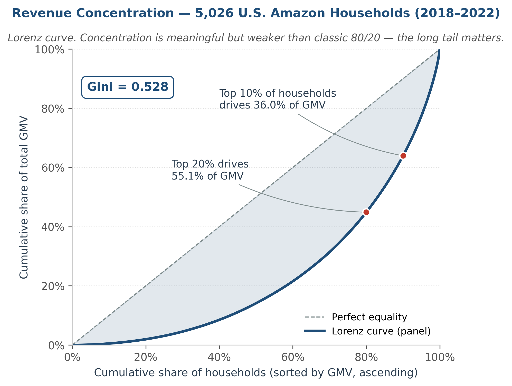
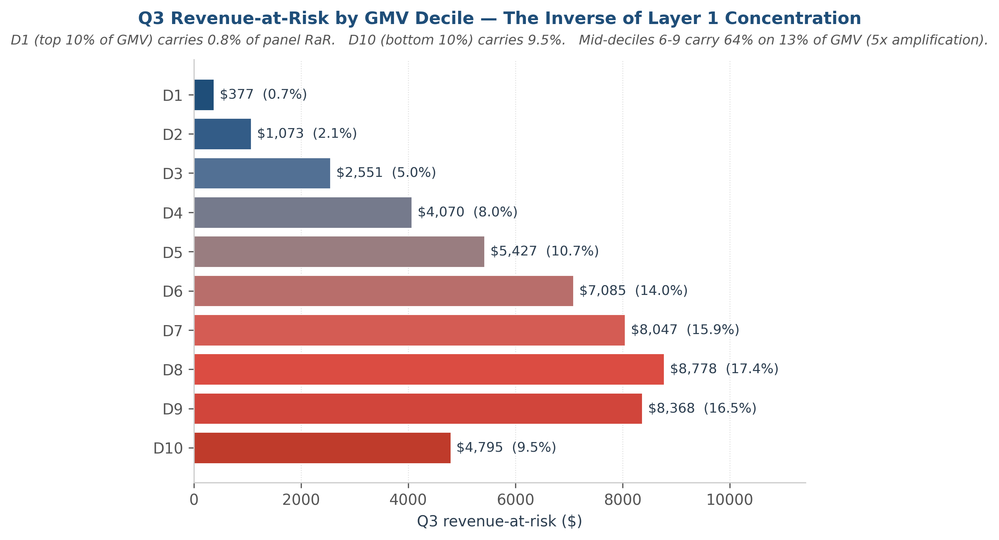
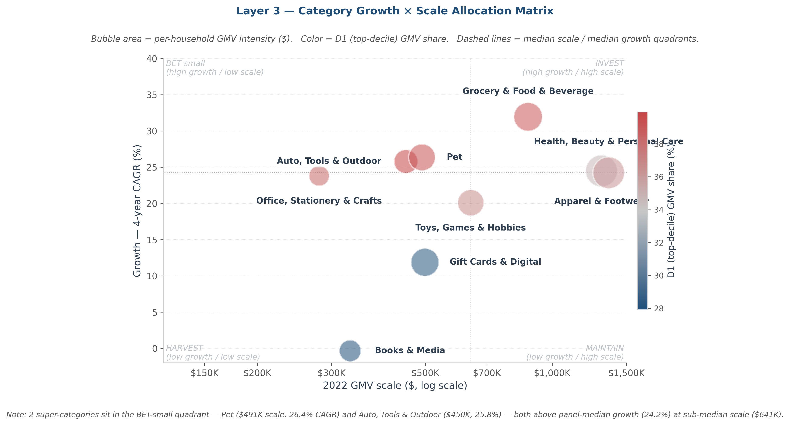
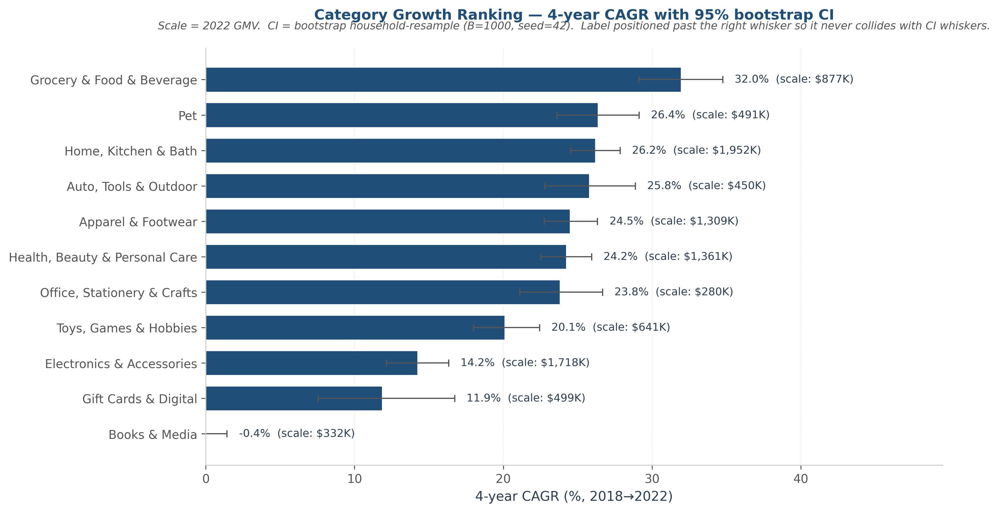
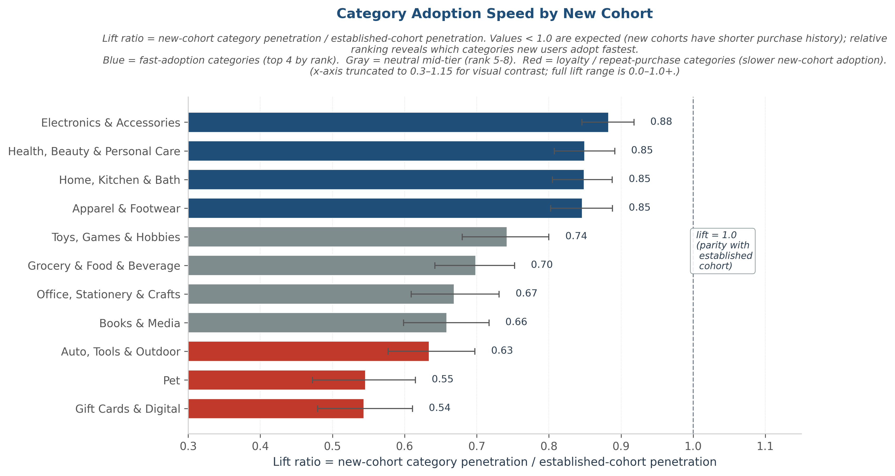
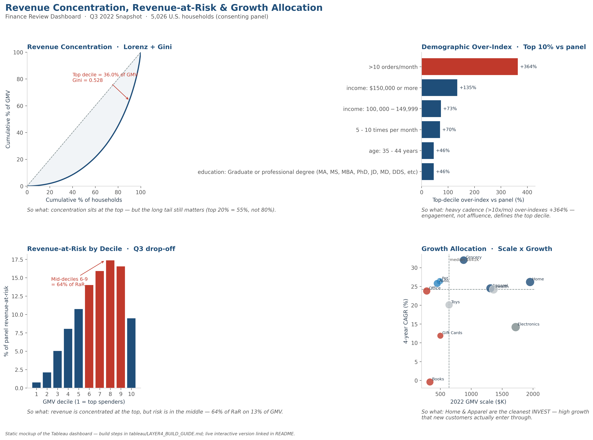

# Amazon Revenue Analytics
*Concentration, Forward-Looking Revenue-at-Risk, and Growth Allocation*

**A BI framework for finance decision support, built on 5,026 U.S. Amazon households (2018–2022).**

[](outputs/figures/layer1/lorenz_curve.png)

---

## TL;DR

Three finance questions on a 5,026-household U.S. Amazon panel (2018–2022, ~1.85M transactions): **where does revenue concentrate, what is at risk next quarter, and which categories deserve more budget?**

The short answers: concentration sits at the top (the top 10% of households drive ~36% of GMV), but next-quarter risk sits in the *middle* (mid-tier deciles carry 64% of revenue-at-risk while the top decile carries under 1%). And category growth comes in two kinds. Some grow by pulling in new households, others by getting existing ones to spend more.

**Data:** the public [Open e-commerce 1.0](https://doi.org/10.7910/DVN/YGLYDY) dataset (Berke et al., *Scientific Data* 2024), 5,027 U.S. households who consented to share their Amazon purchase history, hosted on Harvard Dataverse. Method is SQL-first (DuckDB), with a Polars cross-check on the totals and bootstrap 95% confidence intervals on the headline numbers. The full method and caveats live in **[METHODOLOGY.md](METHODOLOGY.md)**.

---

## The Question

Picture the Amazon Retail Finance team planning next quarter's budget. They'd want three things answered:

1. Where is revenue concentrated, and is the concentration growing?
2. Which customer segments carry the largest revenue-at-risk next quarter?
3. Which categories deserve priority investment, given growth and scale?

Each question gets its own layer. My job is just to build the numbers they'd decide from. I'm not the one making the forecast or calling the budget.

## The Answer
**Layer 1: concentration sits at the top.** In this 5,026-household panel, the top 10% of households drive **35.9% of GMV** (gross merchandise value, i.e. total household spend; top 20%: 55%; Gini 0.528, a standard 0–1 concentration score). That is real concentration, but it's short of a classic 80/20 split, so the long tail still matters. If you only chased the VIPs, you'd miss almost two-thirds of GMV. The gap is almost all *how often people buy*, not how much per order: top-decile households buy ~11× more often but spend only ~1.1× more per purchase. And the clearest marker of a top-decile household is how often they shop, not how much they earn. Frequent shoppers (>10×/month) stand out far more than high earners ($150K+) do. Concentration actually *fell* slightly during COVID while panel GMV nearly doubled (2018 $5.5M → 2022 $10.7M), the surge was mass-market, not VIP-only.

**Layer 2: but the risk sits in the middle.** Households that buy steadily are also the least likely to go quiet, so next-quarter risk should show up where buying is *least* stable, and it does. The top decile drives 35.9% of GMV but only **0.7% of next-quarter revenue-at-risk**; the bottom decile is the mirror image (0.6% of GMV, 9.5% of the risk). The mid-deciles (6–9) carry **64% of revenue-at-risk on just 14% of GMV.** So the households that matter for *growth* and the households that matter for *retention* are not the same.

[](outputs/figures/layer2/decile_rar_ladder.png)

*The risk ranking comes from a simple model (logistic regression) that scores each household's chance of going quiet next quarter. It's trained only on data through mid-2022 and tested against what actually happened in Q3, so it's a real backtest and not hindsight. (How the model is kept from peeking at the future is in [METHODOLOGY.md](METHODOLOGY.md).)*

**Layer 3: Scale × Growth alone would mislead.** Layer 1 found where revenue *is*, Layer 2 found where risk *is*, and Layer 3 asks where new budget should *go*. Eleven super-categories were rolled up from 1,871 raw Amazon category labels (using Claude Opus 4.7 to build the taxonomy; the mapping is committed and spot-checked). If you only look at Scale × Growth, you'd just chase the fast-growing categories. But once you bring Layers 1 and 2 back in, the picture changes. **Pet looks like a high-growth bet, but its growth is existing-customer loyalty, not new-customer acquisition. Books looks like a "harvest" category, but it is actually broad-base retention**, so cutting it would hit exactly the mid-decile households Layer 2 flagged as risky. New customers mostly arrive through everyday categories (Electronics, Health & Personal Care, Home, Apparel), not specialty ones. The takeaway: split the budget three ways. Keep the top households, protect the shaky middle, and pull new customers in through the categories they actually start with, instead of betting on one category for growth.

[](outputs/figures/layer3/category_allocation_matrix.png)

## The Method

One sentence per layer. The full how-and-why (data checks, the risk model, the category grouping) is in **[METHODOLOGY.md](METHODOLOGY.md)**:

- **Foundation.** SQL-first on ~1.85M transactions via DuckDB; every total is double-checked against an equivalent Polars version, and the raw file is validated against the published source before anything runs.
- **Layer 1.** Rank households into 10 equal groups (`NTILE(10)`), measure concentration with a Lorenz curve + Gini, and split the gap into "buys more often" vs. "bigger baskets." Every headline number carries a bootstrap 95% confidence interval (1,000 resamples), so it comes with a margin of error rather than a bare point estimate.
- **Layer 2.** A simple model (logistic regression) scores each household's chance of going inactive in Q3 2022, trained only on data through mid-2022 and tested on what actually happened (a walk-forward backtest). Revenue-at-risk = that chance × the household's expected Q3 spend.
- **Layer 3.** A Claude-built grouping of 1,871 raw labels into 11 categories (committed + spot-checked), 4-year CAGR for growth, and a join that folds the Layer 1 groups and Layer 2 risk back into the category view.

## The Caveat

These 5,026 households are essentially the **full consenting panel**, not a random sample of Amazon's customers, so every number reads as "within this panel," never "across Amazon." The panel shops more than Amazon's average customer (87% were active in Q3), so any "how engaged are people" number here is probably on the high side. "Revenue-at-risk" is a single-quarter *expected* figure (each household's chance of going quiet × what it would have spent), not a worst-case number and not permanent lost revenue. Demographics are a one-time 2021 snapshot.

---

## Layer 3: Category Allocation Matrix (deep dive)

> *Which categories deserve priority investment, given growth and scale?*

The 11 super-categories (plus an explicit `Other / Unknown` bucket) are rolled up from 1,871 raw Amazon category labels via a committed Claude Opus 4.7 taxonomy. Coverage and the false-positive audit are in [METHODOLOGY.md](METHODOLOGY.md).

- **Scale** = 2022 GMV per category (current footprint in the panel).
- **Growth** = 4-year CAGR, `(2022 / 2018)^(1/4) − 1` (the 4-year window smooths out COVID distortion).
- Quadrants split on the panel **median scale ($641K)** and **median CAGR (24.2%)**.

[](outputs/figures/layer3/category_ranking_table.png)

| Quadrant | Categories (scale, CAGR) |
|---|---|
| **INVEST** (high growth, high scale) | Home, Kitchen & Bath ($1.95M, 26%) · Apparel ($1.31M, 25%) · Grocery ($877K, 32%) |
| **BET-small** (high growth, low scale) | Pet ($491K, 26%) · Auto, Tools & Outdoor ($450K, 26%) |
| **MAINTAIN** (low growth, high scale) | Electronics ($1.72M, 14%) |
| **HARVEST** (low growth, low scale) | Gift Cards ($499K, 12%) · Books & Media ($332K, −0.4%) · Office ($280K, 24%) |
| At the median lines | Health & Personal Care ($1.36M, 24.2%) · Toys ($641K, 20.1%) |

**The second check: where do new customers actually enter?** A naïve read says "invest in INVEST, harvest HARVEST." But looking at how fast *new* households pick up each category (versus long-time ones) reframes it: high growth and new-customer entry are *not* the same categories.

[](outputs/figures/layer3/category_gateway_lift.png)

- **Home & Apparel** are the cleanest INVEST: high growth that new customers also enter through.
- **Pet & Auto** grow from existing customers buying deeper, not from new ones arriving. A retention story, not acquisition.
- **Electronics** is the top entry point but has plateaued, so it's defensive, not a growth bet.
- **Books** is the clearest decline, but it is also broad-reach (88% of households), so cutting it would hit the at-risk middle from Layer 2.

How new-customer adoption is measured, the per-category cross-layer crosswalk, and the Pet "loyalty vs. niche" caveat are in [METHODOLOGY.md](METHODOLOGY.md).

---

## Layer 4: Finance Review Dashboard

A single-screen Tableau dashboard brings the three layers together, one panel per finding, each with its own takeaway.

[](https://public.tableau.com/app/profile/leo.wan3084/viz/AmazonFinanceReviewDashboardQ32022/Dashboard1)

🔗 **[Open the live interactive dashboard on Tableau Public →](https://public.tableau.com/app/profile/leo.wan3084/viz/AmazonFinanceReviewDashboardQ32022/Dashboard1)** *(static preview above; click to filter/hover the published version)*

| Panel | The "so what" |
|---|---|
| Revenue Concentration (Lorenz + Gini) | Concentration is at the top, but the long tail still matters (top 20% = 55%, not 80%). |
| Demographic Over-Index | Heavy shoppers (>10×/mo) stand out far more than high earners. Engagement, not income, marks the top decile. |
| Revenue-at-Risk by Decile | Revenue is at the top, risk is in the middle. Deciles 6–9 hold 64% of risk on 14% of GMV. |
| Growth Allocation | Home & Apparel are the cleanest INVEST: growth that new customers enter through. |

Build steps and the field spec are in [`tableau/LAYER4_BUILD_GUIDE.md`](tableau/LAYER4_BUILD_GUIDE.md); the dashboard reads the CSV extracts in [`tableau/`](tableau/), regenerated by `src/build_tableau_extracts.py`.

---

## Limitations

- **Consenting panel, not Amazon's customer base.** Every number is "within this 5,026-household panel," never "across Amazon." People who consent to share purchase data likely differ from those who don't, and the panel's 87% Q3 activity rate is direct evidence it is more engaged than Amazon's base.
- **Panel attrition vs. purchase attrition are not separable.** A household at zero GMV in a later quarter could have stopped buying on Amazon *or* stopped reporting to the survey vendor, and both look identical here. The 2023-01-01 cohort cap limits the worst of it but cannot fully separate the two.
- **Single-quarter outcome, not churn.** Layer 2 measures "no purchase in 2022-Q3," not permanent churn. About 28% of households silent for a year reactivate within a quarter, so the wording stays "Q3 drop-off" throughout, never "churn."
- **Cohort cap at 2023-01-01.** Post-2023 data is thin (~2% of rows) because people dropped out of the panel. If I kept it, someone who just stopped reporting would look like they'd stopped buying, and that's not a fair assumption.
- **Demographics are a 2021 snapshot.** Income, state, and household size are recorded once, so a household whose income changed across 2018–2022 is misclassified on that dimension.

---

## Repository structure

```
amazon-revenue-analytics/
├── README.md                  ← you are here
├── METHODOLOGY.md             ← full per-layer method + audit trail
├── MANIFEST.md                ← input hashes, output schemas, runtime
├── LICENSE                    ← MIT
├── requirements.txt
├── data/raw/                  ← source CSVs (gitignored, download from Dataverse)
├── sql/                       ← canonical SQL aggregations (7 files, Layers 1–3)
├── src/                       ← reusable Python helpers (loaders, stats, viz, build scripts)
├── notebooks/                 ← 01 concentration · 02 RaR · 03 allocation
├── tableau/                   ← Layer 4 dashboard data + build guide
└── outputs/
    ├── tables/                ← parquet (gitignored) + committed taxonomy files
    └── figures/               ← PNGs @ 300 dpi, organized by layer
```

## Tech stack

- **SQL:** DuckDB (reads CSV / Parquet directly, no separate database)
- **Python:** Polars (1M-row aggregation), Pandas (survey-side joins), NumPy (bootstrap)
- **Stats:** NumPy (Lorenz, Gini, bootstrap CIs), scikit-learn (logistic regression), used to *rank* household risk, not to forecast revenue
- **Viz:** matplotlib + seaborn (finance-clean styling)
- **Notebooks:** Jupyter

Outputs are parquet, not CSV: columnar, 5–10× smaller, and no float-precision loss. Standard in BI workflows.

## How to Run

```bash
git clone <repo>
cd amazon-revenue-analytics
python -m venv .venv && source .venv/bin/activate
pip install -r requirements.txt
 # Place amazon-purchases.csv, survey.csv, fields.csv in data/raw/
# (download from Harvard Dataverse doi:10.7910/DVN/YGLYDY; do NOT open the CSVs
#  in Excel/Sheets/Numbers, which silently truncate at 2^20 rows)
python src/validate_data.py    # provenance preflight, confirms the raw data is complete

# Run the notebooks top to bottom:
jupyter notebook notebooks/01_layer1_concentration.ipynb   # then 02, then 03
# (or rebuild just the SQL intermediates so sql/*.sql run standalone:
#  python -m src.build_sql_inputs)
```

Runtime: ~30s for Layer 1, ~45s for Layer 2 on the full ~1.85M rows (M-series Mac).

## Analytical Layers

| Layer | Question | Notebook |
|---|---|---|
| 1 | Where is revenue concentrated? | `notebooks/01_layer1_concentration.ipynb` |
| 2 | What revenue is at risk next quarter? | `notebooks/02_layer2_rar.ipynb` |
| 3 | Which categories to invest in? | `notebooks/03_layer3_allocation.ipynb` |
| 4 | Can finance see it in one screen? | [Live on Tableau Public](https://public.tableau.com/app/profile/leo.wan3084/viz/AmazonFinanceReviewDashboardQ32022/Dashboard1) |

## Author

Built by **Leo Wan**, BUAI (Artificial Intelligence for Business), USC Marshall School of Business & Viterbi School of Engineering.

This is my first end-to-end BI project. The part that taught me the most wasn't the modeling, it was discovering midway that my raw CSV had been silently truncated by a spreadsheet at 2²⁰ rows, and having to re-verify every number in the repo afterward. Feedback welcome via issues.
