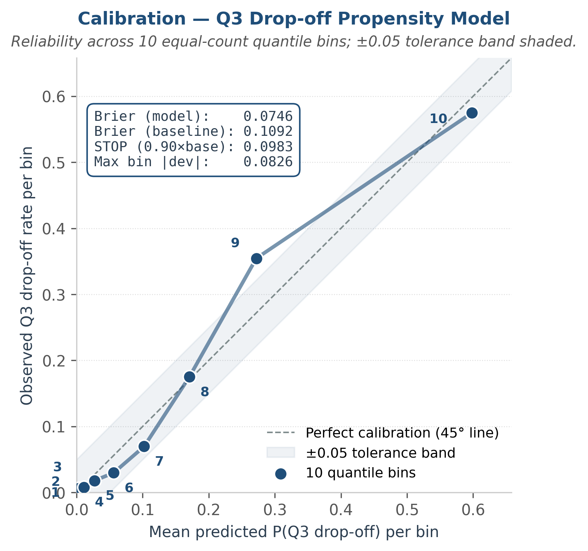
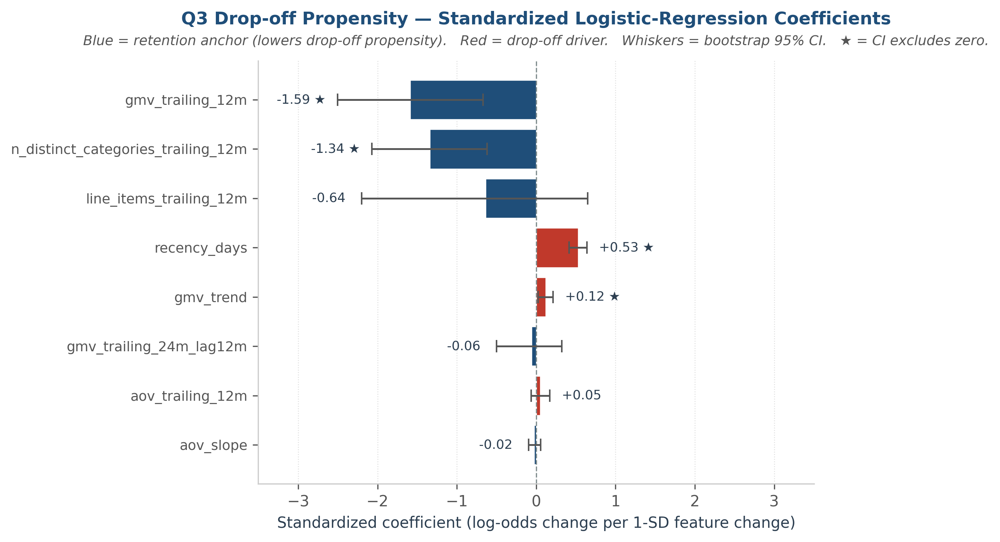

# Amazon Revenue Analytics
*Concentration, Forward-Looking Revenue-at-Risk, and Growth Allocation*

**A BI framework for finance decision support, built on 5,026 U.S. Amazon households (2018–2022).**

[](outputs/figures/layer1/lorenz_curve.png)

---

## TL;DR

Three finance questions on a 5,026-household U.S. Amazon panel (2018–2022, ~1.85M transactions): where revenue concentrates, what is at risk next quarter, and which categories deserve incremental budget.

The short version — concentration sits at the top (the top 10% of households drive ~36% of GMV), forward-looking risk sits in the middle (mid-tier deciles carry 64% of next-quarter revenue-at-risk while the top decile carries under 1%), and growth comes in two kinds (some categories grow by pulling in new households, others by getting existing ones to spend more).

**Data:** the public [Open e-commerce 1.0](https://doi.org/10.7910/DVN/YGLYDY) dataset (Berke et al., *Scientific Data* 2024) — 5,027 U.S. households who consented to share their Amazon purchase history, hosted on Harvard Dataverse.

Method is SQL-first (DuckDB) with a Polars cross-check on every aggregation, bootstrap 95% CIs on every headline ratio, and a final join that brings the concentration and risk results into the category view. Detailed findings, methodology, and limitations below.

---

## Contents

- [TL;DR](#tldr)
- [The Question](#the-question)
- [The Answer](#the-answer)
- [The Method](#the-method)
- [The Caveat](#the-caveat)
- [Methodology](#methodology)
- [Layer 3 — Category Allocation Matrix](#layer-3--category-allocation-matrix-deep-dive)
- [Layer 4 — Finance Review Dashboard](#layer-4--finance-review-dashboard)
- [Limitations](#limitations)
- [Repository Structure](#repository-structure)
- [Tech Stack](#tech-stack)
- [How to Run](#how-to-run)
- [Analytical Layers](#analytical-layers)
- [Author](#author)

---

## The Question

The Amazon Retail Finance team needs to understand three things to inform next-quarter resource allocation:

1. Where is revenue concentrated, and is concentration growing?
2. Which customer segments represent the largest forward-looking revenue-at-risk in the next quarter?
3. Which categories deserve priority investment given current growth × scale dynamics?

This project answers each question with a dedicated analytical layer.

## The Answer

**Layer 1 — concentration.** Within this 5,026-household consenting panel, **the top decile drives 35.9% of GMV [CI: 33.6%, 38.3%]** (top 20%: 54.9%; Gini = 0.528). That is meaningful concentration, but well short of a classic 80/20 split — the long tail still matters — a VIP-only view would miss almost two-thirds of the revenue.

Decomposing the gap shows it is **~95% purchase frequency, only ~5% basket size**: top-decile households make 11.1× more purchases (1,236 vs 111 line-item purchases) but spend just 1.13× more per purchase. In plain terms: getting households to buy more often matters far more than getting them to spend more per order — a premium-upsell strategy would close only ~5% of the per-household gap.

The strongest demographic signal is cadence, not affluence: households shopping more than 10 times per month over-index **+364% [CI: +322%, +414%]** (n=381), dwarfing $150K+ income (+135%, n=463). And concentration actually *fell* during COVID (Δ Gini ≈ -0.04) while panel GMV nearly doubled (2018 $5.5M → 2022 $10.7M) — the surge was mass-market expansion, not VIP-only concentration.

**Layer 2 — revenue concentration is at the top, but revenue-at-risk is in the middle.** Layer 1 showed the top decile's edge is ~95% purchase frequency. Households that buy steadily and often are also the least likely to go quiet — so next-quarter risk should show up where buying is least stable, which is not the top. The data bears this out: top decile drives 35.9% of GMV but only **0.7% of forward-looking RaR** ($377 of $50,573 panel total). Bottom decile contributes 0.6% of GMV but carries **9.5% of RaR** ($4,795) — a **~13x asymmetry** between best-and-worst-case forward stability. Mid-deciles (6-9) carry **64% of RaR while accounting for only 14% of GMV** (~4.7x amplification). The data shows mid-tier RaR exposure is materially larger than top-tier exposure on a panel-share basis.

[](outputs/figures/layer2/decile_rar_ladder.png)

*Layer 2 credibility evidence — model calibration across 10 probability bins, and standardized coefficients with bootstrap 95% CIs:*

[](outputs/figures/layer2/calibration_curve.png)
[](outputs/figures/layer2/coefficient_chart.png)

**Layer 3 — Scale × Growth alone would mislead; adding Layers 1+2 changes the picture.** Layer 1 located where revenue *is* and Layer 2 located where risk *is*; Layer 3 asks where incremental budget should *go*. To answer that honestly, I join the decile structure (Layer 1) and per-household RaR (Layer 2) back into the category view. 11 super-categories (plus an explicit `Other / Unknown` bucket) were rolled up from 1,871 raw Amazon browse-node labels (Claude Opus 4.7 taxonomy, 89% specific-mapped, audit JSON committed). A Scale × Growth read alone would chase the high-growth categories and harvest the flat ones — but joining in Layers 1+2 tells a different story: **the data suggests Pet behaves as VIP-anchored loyalty** (D1 share = 39% of Pet GMV, the lowest mid-decile share at 9.7%, near-lowest acquisition-gateway lift at 0.55), not RaR mitigation. **Books behaves more like a broad-base retention category** (D1 share = 28%, among the lowest; 88% panel breadth; mid-decile GMV share = 18%) — so harvesting it would worsen Layer 2's mid-decile RaR concentration. **New customers mostly enter through broad everyday categories** (Electronics 0.88 / H&PC 0.85 / Home 0.85 / Apparel 0.85), not specialty verticals. The data suggests splitting the budget three ways — keeping top-decile households, protecting the mid-decile revenue at risk, and acquiring new customers — rather than one growth bet per category.

[](outputs/figures/layer3/category_allocation_matrix.png)

## The Method

SQL-first analysis (DuckDB) on ~1.85M Amazon transactions, cohort-capped at 2023-01-01 due to post-2023 participant attrition. I validate the raw inputs against the published [Open e-commerce 1.0](https://doi.org/10.7910/DVN/YGLYDY) source (5,027 households, >1.8M transactions) with a preflight script (`src/validate_data.py`) before running any layer. **Layer 1:** NTILE(10) decile assignment; Lorenz + Gini for concentration shape; log-decomposition for the frequency-vs-basket driver split; bootstrap 95% CIs (B=1000, seed=42) on demographic over-index ratios. **Layer 2:** logistic regression with a walk-forward feature/outcome split (features as-of 2022-06-30, outcome = 2022-Q3 actuals); SQL-level leakage guard + shuffle-label diagnostic (median AUC 0.53 on shuffled labels, max 0.55 — below the 0.60 leakage-suspicion threshold); bootstrap CIs on AUC, coefficients, and segment-level RaR; AUC and calibration are reported in-sample on the full panel — the shuffle diagnostic substitutes for held-out validation; calibration assessed via reliability diagram across 10 quantile bins (9 of 10 within ±0.05; the high-risk bin underestimates, so RaR is reported as a lower bound). **Layer 3:** Claude Opus 4.7 generates a deterministic 1,871→11 super-category taxonomy (plus an `Other / Unknown` bucket; audit JSON committed, 89% specific-mapped + 50-row spot-check); 4-year CAGR (`(2022/2018)^(1/4) − 1`) over raw growth-rate to avoid COVID-baseline distortion; bootstrap CIs on every metric; cross-layer crosswalk joins Layer 1 decile structure + Layer 2 RaR per household into the allocation matrix. Every core aggregation is cross-validated against a Polars equivalent for byte equality.

## The Caveat

The 5,026 households are essentially the **full consenting panel** of 5,027 Prolific prescreen respondents (one dropped by the cohort cap) — not a random sample of Amazon's broader customer base. The panel's 87% Q3 activity rate is a **selection-bias upper bound** on engagement. Revenue-at-risk (RaR) here means **expected exposure**: each household's modeled probability of going inactive in Q3, times its expected Q3 spend — the same shape as expected loss in credit risk (PD × EAD). It is **not** a VaR-style tail metric, and not a claim of permanent revenue loss; it is a single-quarter exposure estimate. Layer 2 RaR magnitudes should therefore be read as upper bounds: the analytical framework (propensity model + segment-level aggregation + bootstrap CIs) generalizes, but I would re-validate the absolute dollars on a production cohort before using them downstream. Demographics are a 2021 snapshot, not a time series.

---

## Methodology

Every headline number is backed by an explicit audit trail — raw-data provenance validation, SQL ↔ Polars byte-equality cross-validation, bootstrap CIs (B=1000, seed=42), the feature-leakage defense, the calibration trade-off, the LLM-taxonomy audit, and each mid-project revision. The full per-layer write-up lives in **[METHODOLOGY.md](METHODOLOGY.md)**.

## Layer 3 — Category Allocation Matrix (Deep Dive)

### The question

> *Which categories deserve priority investment given current growth × scale dynamics?*

The 11 specific super-categories below (plus an explicit `Other / Unknown` bucket) are rolled up from 1,871 raw browse-node leaves via a committed Claude Opus 4.7 taxonomy — coverage, false-positive audit, and JSON path are in [METHODOLOGY.md](METHODOLOGY.md) (Layer 3).

### Scale × Growth dimensions

- **Scale** = 2022 GMV per super-category (current footprint within this panel).
- **Growth** = 4-year CAGR, `(2022 GMV / 2018 GMV)^(1/4) − 1` (the 4-year window normalizes through COVID distortion; rationale in [METHODOLOGY.md](METHODOLOGY.md)).
- **Panel median scale**: **$641K** (Toys); **panel median CAGR**: **24.2%** (Health, Beauty & Personal Care) — these define the quadrant split below.

### Category growth ranking

[](outputs/figures/layer3/category_ranking_table.png)

Grocery leads at **32.0%** CAGR and Books & Media floors at **−0.4%**; the figure above carries the full 11-category ranking with bootstrap CIs, and every category's scale and CAGR appears in the quadrant table below.

### BCG-style quadrant readout

[](outputs/figures/layer3/category_allocation_matrix.png)

Splitting the 11 super-categories along the median scale ($641K) and median CAGR (24.2%) lines:

| Quadrant | n | Super-categories (scale, CAGR) |
|---|---|---|
| **INVEST** — high growth × high scale | 3 | Home, Kitchen & Bath ($1,952K, 26.2%) · Apparel & Footwear ($1,309K, 24.5%) · Grocery ($877K, 32.0%) |
| **BET-small** — high growth × low scale | 2 | Pet ($491K, 26.4%) · Auto, Tools & Outdoor ($450K, 25.8%) |
| **MAINTAIN** — low growth × high scale | 1 | Electronics & Accessories ($1,718K, 14.2%) |
| **HARVEST** — low growth × low scale | 3 | Gift Cards & Digital ($499K, 11.9%) · Books & Media ($332K, −0.4%) · Office, Stationery & Crafts ($280K, 23.8%) |
| At median boundary | 2 | Health, Beauty & Personal Care ($1,361K, 24.2% — at median CAGR) · Toys, Games & Hobbies ($641K, 20.1% — at median scale) |

### High growth ≠ where new customers enter

A naïve BCG read says "invest in INVEST, harvest HARVEST." Layer 3 adds a second check — **cohort acquisition-gateway lift** (new-cohort vs established-cohort category penetration; n=357 vs 4,669). All values are < 1.0, so the **relative ranking is the signal**, not the absolute level.

[](outputs/figures/layer3/category_gateway_lift.png)

| Tier | Lift range | Categories |
|---|---|---|
| Fast-adoption (top 4 by rank) | 0.85–0.88 | Electronics (0.88) · Health, Beauty & Personal Care (0.85) · Home, Kitchen & Bath (0.85) · Apparel (0.85) |
| Neutral mid-tier (rank 5–8) | 0.66–0.74 | Toys (0.74) · Grocery (0.70) · Office (0.67) · Books (0.66) |
| Loyalty / repeat-purchase (bottom 3) | 0.54–0.63 | Auto (0.63) · Pet (0.55) · Gift Cards (0.54) |

**Cross-tabbing the BCG quadrant and the adoption-speed tier produces the operational allocation insight:**

- **Double signal — INVEST × fast-adoption.** Home, Kitchen & Bath and Apparel: high growth that is structurally durable because new customers enter via these categories, not just existing ones spending more — the cleanest INVEST candidates. (Grocery is also INVEST but adopts at a neutral 0.70.)
- **Loyalty-depth growth — BET-small × low gateway.** Pet and Auto: above-median growth but the weakest new-cohort penetration (0.55 / 0.63) — growth here comes from existing customers buying deeper, not from new households arriving — a retention story, not an acquisition one.
- **Stalled entry point — MAINTAIN × fast-adoption.** Electronics has the highest lift of any super-category but below-median growth: a traditional first-purchase category whose growth has plateaued — defensive maintenance, not a growth bet.
- **Pure defensive — HARVEST.** Books, Gift Cards, and Office. Books is the clearest decline story — roughly flat growth, low scale, neither a first-purchase category nor a loyalty anchor.

### Layer 1+2 cross-layer crosswalk

Folding Layer 1 deciles + Layer 2 RaR back in per super-category (D1 GMV share, mid-decile RaR, household breadth) is what makes the matrix actionable:

- **Pet** has high D1 GMV concentration (39.3% from top decile — second only to Auto, Tools & Outdoor at 40.0%) and the lowest mid-decile GMV share (9.7%). With a 0.55 gateway lift (among the lowest), the data suggests Pet behaves as a VIP-anchored loyalty category — not a RaR-mitigation target, despite landing in BET-small on Scale × Growth alone. One caveat on this reading: a high D1 GMV share can reflect either category loyalty (heavy users repeat-buy) or niche-ness (a small buyer pool mechanically concentrates share). Cleanly separating the two would require intra-decile repeat-purchase frequency, which is not computed here — so the loyalty interpretation is directional, and the niche alternative is not fully ruled out.
- **Books** has among the lowest D1 GMV concentration (27.9%) and the broadest panel reach (87.6% of households). It's the closest super-category to a broad-base retention anchor — so the naïve "HARVEST Books" read would hit mid-decile households Layer 2 flagged as carrying 64% of panel RaR.

Full crosswalk parquet + Layer 3-specific limitations (sub-category granularity, gateway lift < 1.0 by construction, no cost-side data) are in [METHODOLOGY.md](METHODOLOGY.md) and the Limitations below.

---

## Layer 4 — Finance Review Dashboard

A single-screen Tableau dashboard brings the three layers back together for the stakeholder questions in [The Question](#the-question) — one panel per finding, each with its own takeaway.

[](https://public.tableau.com/app/profile/leo.wan3084/viz/AmazonFinanceReviewDashboardQ32022/Dashboard1)

🔗 **[Open the live interactive dashboard on Tableau Public →](https://public.tableau.com/app/profile/leo.wan3084/viz/AmazonFinanceReviewDashboardQ32022/Dashboard1)** *(static preview above; click to filter/hover the published version)*

| Panel | Finding (the "so what") |
|---|---|
| **Revenue Concentration** — Lorenz + Gini | Concentration sits at the top — but the long tail still matters (top 20% = 55%, not 80%). |
| **Demographic Over-Index** — top 10% vs panel | Heavy cadence (>10×/mo) over-indexes +364% — engagement, not affluence, defines the top decile. |
| **Revenue-at-Risk by Decile** — Q3 drop-off | Revenue is at the top, but risk is in the middle — mid-deciles 6–9 carry 64% of RaR on 14% of GMV. |
| **Growth Allocation** — Scale × Growth | Home & Apparel are the cleanest INVEST — high growth that new customers actually enter through. |

The image is a static mockup; the interactive version (filters, tooltips) lives on Tableau Public. Panel-by-panel build steps and the field spec are in [`tableau/LAYER4_BUILD_GUIDE.md`](tableau/LAYER4_BUILD_GUIDE.md); the dashboard reads from the committed CSV extracts in [`tableau/`](tableau/), regenerated by `src/build_tableau_extracts.py`.

---

## Limitations

- **Consenting panel, not Amazon's customer base.** All concentration and RaR numbers should be read as "within this 5,026-household panel," never "across Amazon's customers." Selection bias is plausible — people who consent to share purchase data may differ from those who don't. The panel's 87% Q3 activity rate is direct evidence of this selection-bias direction: the panel is more engaged than the broader Amazon population. Prolific (the survey vendor) recruits a paid online research panel, which skews younger, more digitally engaged, and lower-median-income than Amazon's broader customer base — over-index figures should be read as panel-internal, not extrapolable.
- **Panel attrition vs purchase attrition are not separable.** A household showing zero GMV in a later quarter could have (a) stopped buying on Amazon or (b) stopped reporting to Prolific. Both manifest identically as zero in this dataset; the cohort cap at 2023-01-01 mitigates the worst of (b) but cannot fully disentangle the two within the analysis window.
- **Single-quarter outcome window.** Layer 2's `is_dropoff_q3` measures absence of any purchase in 2022-Q3. This is *not* permanent churn — a diagnostic check found that ~28% of households silent for the trailing 12 months reactivate within the next quarter. The terminology used throughout Layer 2 is "Q3 drop-off" or "Q3 inactivity," never "churn," to preserve this distinction.
- **Cohort cap at 2023-01-01.** Post-2023 data is sparse (39,924 of 1,850,717 rows, ~2.2%) due to participant attrition. Including post-2023 data would right-censor users who simply stopped reporting purchases. **One household excluded:** `R_1d1fnT4sjZABBwe`, single $1.84 order on 2024-08-15 — clearly a late panel joiner with no 2018–2022 activity.
- **Demographics are a 2021 snapshot.** Income, state, household size are recorded once at survey time. They are not a time series; a household whose income changed between 2018 and 2022 will be misclassified along that dimension.

---

## Repository structure

```
amazon-revenue-analytics/
├── README.md                              ← you are here
├── METHODOLOGY.md                          ← full per-layer methodology + audit trail
├── MANIFEST.md                            ← input hashes, output schemas, runtime
├── LICENSE                                ← MIT
├── requirements.txt
├── data/raw/                              ← source CSVs (gitignored)
│   ├── amazon-purchases.csv               ← 1,850,717 transactions, 313 MB
│   ├── survey.csv                         ← 5,027 respondents × 23 demographics
│   └── fields.csv                         ← survey column dictionary
├── sql/                                   ← canonical SQL aggregations (first-class)
│   ├── 01_user_gmv_cohort_dated.sql       ← Layer 1: user-level GMV, STRPTIME cohort date cap
│   ├── 02_decile_assignment.sql           ← Layer 1: NTILE(10) window function
│   ├── 03_decile_contribution.sql         ← Layer 1: decile × GMV percent rollup
│   ├── 04_demographic_join.sql            ← Layer 1: decile-tagged table ⨝ survey demographics
│   ├── 05_household_features.sql          ← Layer 2: 5 SQL features (+3 derived in Polars) + walk-forward leakage guard
│   ├── 06_q3_outcome.sql                  ← Layer 2: `is_dropoff_q3` outcome variable
│   └── 07_category_rollup.sql             ← Layer 3: super-category × year rollup (joins taxonomy JSON)
├── src/                                   ← reusable Python helpers
│   ├── data_loader.py                     ← Polars / DuckDB loaders + date probe
│   ├── validate_data.py                   ← raw-data provenance preflight (run before any layer)
│   ├── stats_utils.py                     ← Gini, Lorenz points, bootstrap over-index CI
│   ├── viz_utils.py                       ← finance-clean matplotlib styling
│   ├── manifest_utils.py                  ← SHA256 + MANIFEST writer
│   ├── build_tableau_extracts.py          ← Layer 4: parquet → Tableau CSV extracts
│   └── build_layer4_mockup.py             ← Layer 4: static 2×2 dashboard mockup
├── notebooks/
│   ├── 01_layer1_concentration.ipynb      ← Layer 1 main analysis
│   ├── 02_layer2_rar.ipynb                ← Layer 2 main analysis (forward-looking RaR)
│   └── 03_layer3_allocation.ipynb         ← Layer 3 main analysis (growth allocation matrix)
├── tableau/                               ← Layer 4: dashboard data + build guide
│   ├── LAYER4_BUILD_GUIDE.md              ← click-by-click Tableau Public build
│   └── *.csv                              ← 6 panel extracts (Lorenz, decile, over-index, RaR×2, scale×growth)
└── outputs/
    ├── tables/                            ← parquet tables (gitignored — regenerable) + 2 committed taxonomy files (Layer 3)
    └── figures/                           ← 11 PNG figures @ 300 dpi (committed), organized by layer
        ├── layer1/                         ← lorenz_curve, decile_contribution_bar, concentration_over_time
        ├── layer2/                         ← decile_rar_ladder (hero), coefficient_chart, calibration_curve, roc_curve
        ├── layer3/                         ← category_allocation_matrix (hero), category_ranking_table, category_gateway_lift
        └── layer4/                         ← dashboard_mockup (2×2 Finance Review Dashboard)
```

## Tech stack

- **SQL:** DuckDB (in-process, reads CSV / Parquet directly — no separate database)
- **Python:** Polars (1M-row aggregation), Pandas (survey-side joins), NumPy (bootstrap)
- **Stats:** NumPy (Lorenz, Gini, bootstrap CIs); scikit-learn (logistic regression, calibration, ROC) — used to rank household risk, not to forecast revenue
- **Viz:** matplotlib + seaborn (finance-clean styling, locked palette in `src/viz_utils.py`)
- **Notebooks:** Jupyter (deliverable format)

Why parquet and not CSV for outputs: columnar, 5–10× smaller, no float-precision loss, standard in BI workflows.

## How to Run

```bash
git clone <repo>
cd amazon-revenue-analytics
python -m venv .venv && source .venv/bin/activate
pip install -r requirements.txt
# Place amazon-purchases.csv, survey.csv, fields.csv in data/raw/
# (download the originals from Harvard Dataverse doi:10.7910/DVN/YGLYDY —
#  do NOT open the CSVs in Excel/Sheets/Numbers, which silently truncate at 2^20 rows)
python src/validate_data.py   # provenance preflight: confirms the raw data is complete

# Option A — run the notebooks top-to-bottom (canonical pipeline):
jupyter notebook notebooks/01_layer1_concentration.ipynb   # then 02_layer2_rar.ipynb, 03_layer3_allocation.ipynb

# Option B — just rebuild the SQL intermediate parquets so the sql/*.sql
# files are runnable standalone (without spinning up Jupyter):
python -m src.build_sql_inputs
# Then any SQL file works directly, e.g.:
#   duckdb -c "$(cat sql/02_decile_assignment.sql)"
```

Observed runtime: **~30 sec** for Layer 1, **~45 sec** for Layer 2 on the full ~1.85M-row dataset (M-series Mac). Layer 2's full bootstrap pipeline — 1,000 LR re-fits for AUC + coefficient CIs, 50 shuffle-label refits, 51,000 segment-RaR resamples — completes in a few seconds via vectorised NumPy.

## Analytical Layers

| Layer | Question | Status | Notebook |
|---|---|---|---|
| 1 | Where is revenue concentrated? | ✅ Done | `notebooks/01_layer1_concentration.ipynb` |
| 2 | What revenue is at risk next quarter? | ✅ Done | `notebooks/02_layer2_rar.ipynb` |
| 3 | Which categories to invest in? | ✅ Done | `notebooks/03_layer3_allocation.ipynb` |
| 4 | Can finance see it all in one screen? | ✅ [Live on Tableau Public](https://public.tableau.com/app/profile/leo.wan3084/viz/AmazonFinanceReviewDashboardQ32022/Dashboard1) | `tableau/` + `LAYER4_BUILD_GUIDE.md` |

## Author

Built by **Leo Wan**, BUAI (Artificial Intelligence for Business) program — USC Marshall School of Business & Viterbi School of Engineering.

This is my first end-to-end BI project. The part that taught me the most wasn't the modeling — it was discovering midway that my raw CSV had been silently truncated by a spreadsheet at 2²⁰ rows, and having to re-verify every number in the repo afterwards. Feedback welcome via issues.
